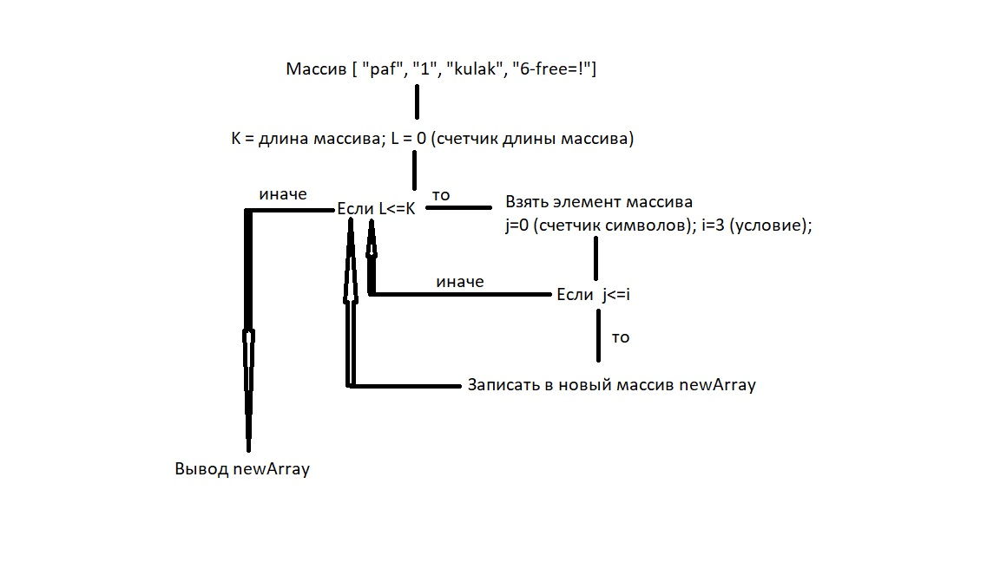

# GB_first_results
# Контрольная работа по итогам первой четверти обучения по программе "Разработчик"
# Задача.
Написать программу, которая из имеющегося массива строк формирует массив из строк, длина которых меньше либо равна 3 символа. Первоначальный массив можно ввести с клавиатуры, либо задать на старте выполнения алгоритма. Пример: ["hello", "2", "world", ";-)"] -> ["2", ";-)"]

